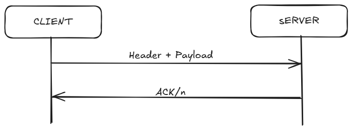

# TP0: Docker + Comunicaciones + Concurrencia

En el presente repositorio se provee un esqueleto básico de cliente/servidor, en donde todas las dependencias del mismo se encuentran encapsuladas en containers. Los alumnos deberán resolver una guía de ejercicios incrementales, teniendo en cuenta las condiciones de entrega descritas al final de este enunciado.

 El cliente (Golang) y el servidor (Python) fueron desarrollados en diferentes lenguajes simplemente para mostrar cómo dos lenguajes de programación pueden convivir en el mismo proyecto con la ayuda de containers, en este caso utilizando [Docker Compose](https://docs.docker.com/compose/).

## Instrucciones de uso
El repositorio cuenta con un **Makefile** que incluye distintos comandos en forma de targets. Los targets se ejecutan mediante la invocación de:  **make \<target\>**. Los target imprescindibles para iniciar y detener el sistema son **docker-compose-up** y **docker-compose-down**, siendo los restantes targets de utilidad para el proceso de depuración.

Los targets disponibles son:

| target  | accion  |
|---|---|
|  `docker-compose-up`  | Inicializa el ambiente de desarrollo. Construye las imágenes del cliente y el servidor, inicializa los recursos a utilizar (volúmenes, redes, etc) e inicia los propios containers. |
| `docker-compose-down`  | Ejecuta `docker-compose stop` para detener los containers asociados al compose y luego  `docker-compose down` para destruir todos los recursos asociados al proyecto que fueron inicializados. Se recomienda ejecutar este comando al finalizar cada ejecución para evitar que el disco de la máquina host se llene de versiones de desarrollo y recursos sin liberar. |
|  `docker-compose-logs` | Permite ver los logs actuales del proyecto. Acompañar con `grep` para lograr ver mensajes de una aplicación específica dentro del compose. |
| `docker-image`  | Construye las imágenes a ser utilizadas tanto en el servidor como en el cliente. Este target es utilizado por **docker-compose-up**, por lo cual se lo puede utilizar para probar nuevos cambios en las imágenes antes de arrancar el proyecto. |
| `build` | Compila la aplicación cliente para ejecución en el _host_ en lugar de en Docker. De este modo la compilación es mucho más veloz, pero requiere contar con todo el entorno de Golang y Python instalados en la máquina _host_. |

### Servidor

Se trata de un "echo server", en donde los mensajes recibidos por el cliente se responden inmediatamente y sin alterar. 

Se ejecutan en bucle las siguientes etapas:

1. Servidor acepta una nueva conexión.
2. Servidor recibe mensaje del cliente y procede a responder el mismo.
3. Servidor desconecta al cliente.
4. Servidor retorna al paso 1.


### Cliente
 se conecta reiteradas veces al servidor y envía mensajes de la siguiente forma:
 
1. Cliente se conecta al servidor.
2. Cliente genera mensaje incremental.
3. Cliente envía mensaje al servidor y espera mensaje de respuesta.
4. Servidor responde al mensaje.
5. Servidor desconecta al cliente.
6. Cliente verifica si aún debe enviar un mensaje y si es así, vuelve al paso 2.

### Ejemplo

Al ejecutar el comando `make docker-compose-up`  y luego  `make docker-compose-logs`, se observan los siguientes logs:

```
client1  | 2024-08-21 22:11:15 INFO     action: config | result: success | client_id: 1 | server_address: server:12345 | loop_amount: 5 | loop_period: 5s | log_level: DEBUG
client1  | 2024-08-21 22:11:15 INFO     action: receive_message | result: success | client_id: 1 | msg: [CLIENT 1] Message N°1
server   | 2024-08-21 22:11:14 DEBUG    action: config | result: success | port: 12345 | listen_backlog: 5 | logging_level: DEBUG
server   | 2024-08-21 22:11:14 INFO     action: accept_connections | result: in_progress
server   | 2024-08-21 22:11:15 INFO     action: accept_connections | result: success | ip: 172.25.125.3
server   | 2024-08-21 22:11:15 INFO     action: receive_message | result: success | ip: 172.25.125.3 | msg: [CLIENT 1] Message N°1
server   | 2024-08-21 22:11:15 INFO     action: accept_connections | result: in_progress
server   | 2024-08-21 22:11:20 INFO     action: accept_connections | result: success | ip: 172.25.125.3
server   | 2024-08-21 22:11:20 INFO     action: receive_message | result: success | ip: 172.25.125.3 | msg: [CLIENT 1] Message N°2
server   | 2024-08-21 22:11:20 INFO     action: accept_connections | result: in_progress
client1  | 2024-08-21 22:11:20 INFO     action: receive_message | result: success | client_id: 1 | msg: [CLIENT 1] Message N°2
server   | 2024-08-21 22:11:25 INFO     action: accept_connections | result: success | ip: 172.25.125.3
server   | 2024-08-21 22:11:25 INFO     action: receive_message | result: success | ip: 172.25.125.3 | msg: [CLIENT 1] Message N°3
client1  | 2024-08-21 22:11:25 INFO     action: receive_message | result: success | client_id: 1 | msg: [CLIENT 1] Message N°3
server   | 2024-08-21 22:11:25 INFO     action: accept_connections | result: in_progress
server   | 2024-08-21 22:11:30 INFO     action: accept_connections | result: success | ip: 172.25.125.3
server   | 2024-08-21 22:11:30 INFO     action: receive_message | result: success | ip: 172.25.125.3 | msg: [CLIENT 1] Message N°4
server   | 2024-08-21 22:11:30 INFO     action: accept_connections | result: in_progress
client1  | 2024-08-21 22:11:30 INFO     action: receive_message | result: success | client_id: 1 | msg: [CLIENT 1] Message N°4
server   | 2024-08-21 22:11:35 INFO     action: accept_connections | result: success | ip: 172.25.125.3
server   | 2024-08-21 22:11:35 INFO     action: receive_message | result: success | ip: 172.25.125.3 | msg: [CLIENT 1] Message N°5
client1  | 2024-08-21 22:11:35 INFO     action: receive_message | result: success | client_id: 1 | msg: [CLIENT 1] Message N°5
server   | 2024-08-21 22:11:35 INFO     action: accept_connections | result: in_progress
client1  | 2024-08-21 22:11:40 INFO     action: loop_finished | result: success | client_id: 1
client1 exited with code 0
```


## Parte 1: Introducción a Docker
En esta primera parte del trabajo práctico se plantean una serie de ejercicios que sirven para introducir las herramientas básicas de Docker que se utilizarán a lo largo de la materia. El entendimiento de las mismas será crucial para el desarrollo de los próximos TPs.

### Ejercicio N°1:
Se definió un script `generar-compose.sh` en la raíz del proyecto para generar dinámicamente un archivo de definición de Docker Compose con una cantidad configurable de clientes.
La lógica de construcción del archivo YAML se implementó en un script auxiliar en Python `mi-generador.py`, lo que permitió manipular de forma más flexible el contenido.
Los nombres de los contenedores siguen el formato client1, client2, client3, etc. 

#### Ejecución
- El script recibe dos parámetros:
  1. Nombre del archivo de salida.
  2. Cantidad de clientes a generar.

Ejemplo:
```bash
./generar-compose.sh docker-compose-dev.yaml 5
```

Esto produce un archivo **docker-compose-dev.yaml** con la definición de 5 clientes.


### Ejercicio N°2

Para permitir que los cambios en los archivos de configuración (`config.ini` para el servidor y `config.yaml` para el cliente) se apliquen sin necesidad de reconstruir las imágenes de Docker, modifiqué los Dockerfiles y la definición de los servicios en el archivo `docker-compose`.

Los volúmenes definidos para los archivos de configuración son del tipo **Bind Mounts**. Esto significa que los archivos locales (`config.ini` y `config.yaml`) se vinculan directamente con los archivos dentro de los contenedores, permitiendo que cualquier cambio realizado en el host se refleje automáticamente en el contenedor sin reconstruir la imagen.

Además, se eliminó la línea `COPY ./client/config.yaml /config.yaml` del Dockerfile del cliente. Esto asegura que el archivo de configuración no se copie en la imagen y solo se monte dinámicamente  al crear el contenedor.

### Ejercicio N°3:

Para resolver este ejercicio, creé el script `validar-echo-server.sh` en la raíz del proyecto. El objetivo del script es verificar que el servidor funcione correctamente como echo server, es decir, que responda con el mismo mensaje que recibe.

El script utiliza el comando:

```bash
docker run --rm --network tp0_testing_net busybox sh -c "echo '$MSG' | nc $HOST $PORT"
```

Este comando ejecuta un contenedor temporal de [busybox](https://hub.docker.com/_/busybox), conecta a la [red interna de Docker (`tp0_testing_net`)](https://docs.docker.com/compose/how-tos/networking/) y usa `netcat` (`nc`) para enviar el mensaje definido en la variable `MSG` al servidor (`server`) en el puerto `12345`. La respuesta del servidor se guarda en la variable `output`.

Luego, el script compara la respuesta recibida con el mensaje enviado. Si ambos coinciden, imprime:

```
action: test_echo_server | result: success
```

En caso contrario, imprime:

```
action: test_echo_server | result: fail
```

De esta forma, no es necesario instalar [netcat](https://linux.die.net/man/1/nc) en la máquina host ni exponer puertos del servidor, ya que toda la comunicación ocurre dentro de la red de Docker.

#### Ejecución

Antes de correr la validación, asegurarse de que la red y los contenedores estén creados ejecutando:

```bash
make docker-compose-up
```

Luego, ejecutar en la raíz del proyecto:

```bash
./validar-echo-server.sh
```

El resultado indicará si el servidor está funcionando correctamente como echo server.

### Ejercicio N°4:
Para resolver el , implementé la terminación _graceful_ en ambos sistemas, asegurando el cierre correcto de sockets y recursos al recibir la señal SIGTERM.
Las librerias usadas fueron las siguientes (todas correspondientes a las librerias estandar de ambos lenguajes):
- Python: [_signal_](https://docs.python.org/3/library/signal.html)
- Go: 
  - [_os_](https://pkg.go.dev/os)
  - [_os/signal_](https://pkg.go.dev/os/signal)
  - [_syscall_](https://pkg.go.dev/syscall)
#### Flujo de terminación graceful

**Cliente (Golang)**

1. **Escucha de señales:**  
   En [main.go](https://github.com/agus-germi/tp0-base/blob/ej4/client/main.go#L117-L118), se crea un canal para recibir señales y se configura para escuchar SIGINT y SIGTERM:
   ```go
   sigChan := make(chan os.Signal, 1)
   signal.Notify(sigChan, syscall.SIGINT, syscall.SIGTERM)
   client.StartClientLoop(sigChan)
   ```

2. **Cierre de recursos:**  
   En [client.go](https://github.com/agus-germi/tp0-base/blob/ej4/client/common/client.go#L57-L62), dentro del bucle principal, se verifica si se recibió una señal. Si es así, se cierra el socket y se imprime un mensaje de log:
   ```go
   select {
   case  <-sigChan:
       log.Infof("action: exit | result: success | client_id: %v", c.config.ID)
       if c.conn != nil {
           c.conn.Close()
       }
       return
   default:
       // ...envío de mensaje y recepción...
   }
   ```

**Servidor (Python)**

1. **Escucha de señales:**  
   En [main.py](https://github.com/agus-germi/tp0-base/blob/ej4/server/main.py#L55-L61), se define un handler para SIGTERM:
   ```python
   def handle_sigterm(signum, frame):
       logging.info("action: signal_received | result: in_progress")
       server.shutdown()
       logging.info("action: exit | result: success")
       exit(0)

   signal.signal(signal.SIGTERM, handle_sigterm)
   ```

2. **Control de ejecución y cierre de recursos:**  
   En la clase [Server](https://github.com/agus-germi/tp0-base/blob/ej4/server/common/server.py#L13) (`server.py`), agregué la variable `self._is_running` para controlar el ciclo principal del servidor. Esta variable permite finalizar el bucle de aceptación de conexiones cuando se recibe una señal de cierre:
   ```python
   class Server:
       def __init__(self, port, listen_backlog):
           # ...
           self._is_running = True
   
       def run(self):
           while self._is_running:
               # ...
   
       def shutdown(self):
           self._is_running = False
           try:
               self._server_socket.close()
               logging.info("action: close_socket | result: success")
           except Exception as e:
               logging.error(f"action: close_socket | result: fail")
   ```
   Al llamar a `shutdown()`, se pone `self._is_running = False`, lo que hace que el bucle principal termine y el socket se cierre correctamente.

_También se maneja SIGINT para permitir cierre con Ctrl+C._


## Parte 2: Repaso de Comunicaciones

Las secciones de repaso del trabajo práctico plantean un caso de uso denominado **Lotería Nacional**. Para la resolución de las mismas deberá utilizarse como base el código fuente provisto en la primera parte, con las modificaciones agregadas en el ejercicio 4.

### Ejercicio N°5:
Modificar la lógica de negocio tanto de los clientes como del servidor para nuestro nuevo caso de uso.

#### Cliente
Cada cliente simula una agencia de quiniela.El cliente obtiene los datos de la apuesta desde variables de entorno definidas en el docker-compose.yaml. Cada contenedor cliente se configura con su propio conjunto de variables de entorno que representan la apuesta `Bet`.si


#### Servidor
El servidor representa la central de Lotería Nacional. Al recibir una apuesta, la deserializa y almacena utilizando la función provista `store_bets(...)`, sin modificar su implementación. Si la apuesta se almacena correctamente, registra en el `log: action: apuesta_almacenada | result: success | dni: ${DNI} | numero: ${NUMERO}`

#### Protocolo
##### Estructura del Mensaje 
###### Cliente > Servidor
Cada mensaje que [envía el cliente](https://github.com/agus-germi/tp0-base/blob/ej5/client/common/client.go#L82-L104) tiene la siguiente estructura:
```bash
[Header (4 bytes)] + [Payload (UTF-8)]
```
- **Header**: Contiene la longitud del payload expresada como un número entero en __big_endian__. Si bien 4 bytes de header es más que suficiente para nuestros mensajes de apuestas, nos deja espacio para posibles extensiones del protocolo.
- **Payload**: Contiene el mensaje en sí, con el siguiente formato:
```bash
Nombre|Apellido|DNI|Nacimiento|Numero|Agencia\n
```
###### Servidor > Cliente

Cada vez que el servidor recibe un mensaje válido, responde con un `ACK/n`.
El cliente, por su parte, [valida](https://github.com/agus-germi/tp0-base/blob/ej5/client/common/client.go#L74-L76) que el mensaje recibido corresponda efectivamente a un ACK antes de continuar.

- Esto cumple una doble función:
  1. Evitar falsos positivos (ejemplo: si se recibiera otro tipo de mensaje por error).
  2. Asegurar al cliente que el servidor procesó correctamente la solicitud.



### Ejercicio N°6:

En este ejercicio, se modificó la lógica del cliente y del servidor para permitir el envío y procesamiento de múltiples apuestas en un solo mensaje, utilizando la modalidad de batches (chunks). Esto mejora la eficiencia de la transmisión y el procesamiento, ya que se reduce la cantidad de mensajes intercambiados y se optimiza el uso de la red.

###### Cliente > Servidor
El cliente implementa la funcionalidad de enviar apuestas a un servidor de forma eficiente utilizando **batch processing**. Cada cliente representa a una agencia y toma su archivo de apuestas correspondiente (bets.csv), que es inyectado en el contenedor mediante un volumen de Docker.

El intercambio de mensajes entre Cliente-Servidor se mantiene igual que como especifica la imágen del ej5. 
Con la pequeña modificación a continuación mencionada.

#### Protocolo
En este ejercicio, el protocolo sufre una pequeña adaptación. Como dijimos ya no mandamos _una_ apuesta, sino que mandamos de a  _batches_. 
1. **Serialización de Apuestas**
    Cada apuesta se serializa en el siguiente formato:
   ```bash
    Nombre|Apellido|DNI|Nacimiento|Numero|Agencia
    ```
2. **Batch de Apuestas**
   - Varias apuestas se concatenan con `,` formando un batch. Ejemplo de un batch de 3 apuestas:
       ```bash
        Juan|Perez|12345678|2000-01-01|5|001,Laura|Gomez|87654321|1995-12-12|7|001,Carlos|Lopez|11223344|1990-06-06|9|001
    ```
3. **Header del mensaje**
    - El header sigue teniendo un largo de _4_ _bytes_. Pero, en esta adaptación del protocolo el header indica la longitud total del batch enviado. Esto permite al servidor leer exactamente el tamaño del batch y procesar todas las apuestas de manera átomica.
    - La estructura seguirá siendo de la forma:
    ```bash
    [Header (4 bytes)] + [Payload (UTF-8)]
    ```
    Donde el payload, será ahora el batch enviado. 

6. **Configuración del BatchSize**
   - Cálculo _aproximado_ del tamaño de cada apuesta:
     - `Nombre`: 15-40 bytes
     - `Apellido` : 15-40 bytes
     - `DNI` : 8 bytes
     - `Nacimiento`: 10 bytes
     - `Numero`: 4 bytes
     - `Agencia`: 4 bytes
     - `Delimitadores`: 5 bytes
     - `Coma`: 1 bytes (cada apuesta esta separada de la siguiente con `,`)

    Por lo tanto tengo un total aproximado por apuesta de: 112 bytes. Para asegurarme efectivamente de no pasarme de los *8kB*, lo llevo a una **cota superior de 120 bytes por apuesta**. 

    >$batch\_Amount = \left\lfloor \frac{8192}{120} \right\rfloor = 68$

### Ejercicio N°7:

Modificar los clientes para que notifiquen al servidor al finalizar con el envío de todas las apuestas y así proceder con el sorteo.
Inmediatamente después de la notificacion, los clientes consultarán la lista de ganadores del sorteo correspondientes a su agencia.
Una vez el cliente obtenga los resultados, deberá imprimir por log: `action: consulta_ganadores | result: success | cant_ganadores: ${CANT}`.

El servidor deberá esperar la notificación de las 5 agencias para considerar que se realizó el sorteo e imprimir por log: `action: sorteo | result: success`.
Luego de este evento, podrá verificar cada apuesta con las funciones `load_bets(...)` y `has_won(...)` y retornar los DNI de los ganadores de la agencia en cuestión. Antes del sorteo no se podrán responder consultas por la lista de ganadores con información parcial.

Las funciones `load_bets(...)` y `has_won(...)` son provistas por la cátedra y no podrán ser modificadas por el alumno.

No es correcto realizar un broadcast de todos los ganadores hacia todas las agencias, se espera que se informen los DNIs ganadores que correspondan a cada una de ellas.

## Parte 3: Repaso de Concurrencia
En este ejercicio es importante considerar los mecanismos de sincronización a utilizar para el correcto funcionamiento de la persistencia.

### Ejercicio N°8:

El objetivo de este ejercicio fue modificar el servidor de apuestas para que pueda:
1. Aceptar múltiples conexiones de clientes simultáneamente.
2. Procesar mensajes de manera paralela, manteniendo la integridad de los datos compartidos (como el registro de apuestas y la lista de ganadores).

Para lograr esto, se utilizó Python con la librería [threading](https://docs.python.org/es/dev/library/threading.html#), teniendo en cuenta las limitaciones del [GIL (Global Interpreter Lock)](https://wiki.python.org/moin/GlobalInterpreterLock).
En cuanto al GIL se tomo la decisión de igualmente usar la librería mencionada anteriormente, la consideré adecuada para este proyecto, ya que las operaciones principales del servidor son de **entrada/salida (I/O)** —lectura de sockets, escritura de archivos y envío de datos por red— donde el GIL se libera mientras se espera la finalización de la operación de I/O. Esto permite que múltiples hilos sean ejecutados concurrentemente sin bloqueo significativo.

>(...) _"Luckily, many potentially blocking or long-running operations, such as I/O, image processing, and NumPy number crunching, happen **outside the GIL**. Therefore it is only in multithreaded programs that spend a lot of time inside the GIL, interpreting CPython bytecode, that the GIL becomes a bottleneck."_ 
    >><u>Fuente:</u> https://wiki.python.org/moin/GlobalInterpreterLock

#### Arquitectura de hilos
##### Hilos de Clientes
Cada vez que un cliente se conecta al servidor, [se crea un **hilo independiente** encargado de atenderlo](https://github.com/agus-germi/tp0-base/blob/ej8/server/common/server.py#L42-L47). Estos hilos ejecutan la [función `__handle_client_connection`](https://github.com/agus-germi/tp0-base/blob/ej8/server/common/server.py#L222-L253), que realiza las siguientes acciones:
1. Lee mensajes del cliente de manera secuencial desde su socket.
2. Parsea las apuestas recibidas y valida su formato.
3. Almacena las apuestas usando un [Lock](https://docs.python.org/es/3.8/library/threading.html#lock-objects) (`_file_lock`) para proteger el acceso a los datos compartidos y evitar condiciones de carrera.
4. Envía un acuse de recepción (`ACK`) o un mensaje de error (`ERROR`) según corresponda.

El uso de hilos de cliente permite que varios clientes envíen apuestas en paralelo sin bloquear la atención de otros. La concurrencia no se ve afectada significativamente por el GIL porque las llamadas de red (`recv` y `send`) liberan el GIL durante la espera.

##### Hilo Coordinador
Se implementó un hilo coordinador encargado de calcular los ganadores y enviar los resultados a cada agencia una vez que **todas** hayan enviado su mensaje de finalización (`END`).
El `target` de este hilo es la [función `_wait_for_all`](https://github.com/agus-germi/tp0-base/blob/ej8/server/common/server.py#L176-L187), que contiene la lógica para:
1. Esperar a que todas las agencias hayan enviado el mensaje END.
2. Calcular los ganadores del sorteo (`_calculate_winners`).
3. Enviar los resultados a cada agencia (`_send_results`).
4. Limpiar los recursos utilizados por el servidor (`_clean_resources`).
Dentro de `_wait_for_all`, se utiliza un [objeto **Condition**](https://docs.python.org/es/dev/library/threading.html#condition-objects) (`_all_done`) para esperar de manera eficiente a que todos los clientes hayan finalizado su envío de apuestas. Esto evita el uso de bucles de espera activa y reduce el consumo de CPU.
Entonces [una vez que todos los clientes enviaron el mensaje de `END`](https://github.com/agus-germi/tp0-base/blob/ej8/server/common/server.py#L135-L138), se notifica mediante un `notify_all()`,  liberando al hilo coordinador para que continúe con el cálculo de ganadores y el envío de resultados. La actualización de `_agencies_done` está protegida por el lock asociado a la condición, garantizando la consistencia de los datos compartidos y evitando condiciones de carrera.
----------------------------------------------------------------------------------------------------------------------
> _**(*) Elección de threading sobre multiprocessing**_
- _**threading**: adecuado para operaciones de I/O concurrentes. Permite compartir fácilmente recursos (listas, diccionarios, locks) entre hilos sin la sobrecarga de inter-proces communication (IPC)._
- _**multiprocessing**: más indicado para operaciones CPU-intensive, ya que cada proceso tiene su propio GIL y memoria independiente. Sin embargo, requiere mecanismos de comunicación complejos para compartir datos y sincronización, lo cual no es necesario para este servidor._

_En este proyecto, la mayor parte del trabajo es I/O (recepción y envío de datos por sockets, almacenamiento en archivo), por lo que threading ofrece una solución simple y suficiente para cumplir los objetivos del ejercicio._

## Condiciones de Entrega
Se espera que los alumnos realicen un _fork_ del presente repositorio para el desarrollo de los ejercicios y que aprovechen el esqueleto provisto tanto (o tan poco) como consideren necesario.

Cada ejercicio deberá resolverse en una rama independiente con nombres siguiendo el formato `ej${Nro de ejercicio}`. Se permite agregar commits en cualquier órden, así como crear una rama a partir de otra, pero al momento de la entrega deberán existir 8 ramas llamadas: ej1, ej2, ..., ej7, ej8.
 (hint: verificar listado de ramas y últimos commits con `git ls-remote`)

Se espera que se redacte una sección del README en donde se indique cómo ejecutar cada ejercicio y se detallen los aspectos más importantes de la solución provista, como ser el protocolo de comunicación implementado (Parte 2) y los mecanismos de sincronización utilizados (Parte 3).

Se proveen [pruebas automáticas](https://github.com/7574-sistemas-distribuidos/tp0-tests) de caja negra. Se exige que la resolución de los ejercicios pase tales pruebas, o en su defecto que las discrepancias sean justificadas y discutidas con los docentes antes del día de la entrega. El incumplimiento de las pruebas es condición de desaprobación, pero su cumplimiento no es suficiente para la aprobación. Respetar las entradas de log planteadas en los ejercicios, pues son las que se chequean en cada uno de los tests.

La corrección personal tendrá en cuenta la calidad del código entregado y casos de error posibles, se manifiesten o no durante la ejecución del trabajo práctico. Se pide a los alumnos leer atentamente y **tener en cuenta** los criterios de corrección informados  [en el campus](https://campusgrado.fi.uba.ar/mod/page/view.php?id=73393).
